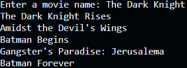
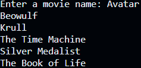
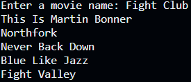

# MovieMatch AI: A Movie Recommendation System Based on the TMDB Dataset

## Introduction

Recommendation systems are one of the most important applications of machine learning algorithms. They are used to predict the rating or preference that a user would give to an item. This repository contains a simple a movie recommendation system based on the TMDB dataset. The TMDB dataset contains information on 5000 movies, including user ratings, budget, revenue, cast, genres, etc.

MovieMatch AI is a recommendation system that recommends the top 5 most similar movies based on the input given by the user. The input is a movie title that the user likes.

## Dataset

The dataset can be found [here](https://www.kaggle.com/tmdb/tmdb-movie-metadata). It contains two files: `tmdb_5000_credits.csv` and `tmdb_5000_movies.csv`. The first file contains the following features:

* `movie_id`
* `title`
* `cast`
* `crew`

The second file contains the following features:

* `budget`
* `genres`
* `homepage`
* `id`
* `keywords`
* `original_language`
* `original_title`
* `overview`
* `popularity`
* `production_companies`
* `production_countries`
* `release_date`
* `revenue`
* `runtime`
* `spoken_languages`
* `status`
* `tagline`
* `title`
* `vote_average`
* `vote_count`

## Methodology

The recommendation system is based on the following features:

* `movie_id`
* `title`
* `overview`
* `genres`
* `keywords`
* `cast`
* `crew`

The recommendation system uses the following steps:

1. Load the datasets.
2. Remove the unnecessary features.
3. Data prerpocessing
4. Initialize a new dataframe and merge the following features into a single column called `tags`:
   * `movie_id`
   * `title`
   * `cast`
   * `crew`
5. Train the model
6. Test the model and print the top 5 recommended movies.

## Libraries

The following libraries were used in this project:

* `pandas`
* `scikit-learn` (for `CountVectorizer` and `cosine_similarity`)
* `ast`
* `pickle`

## Results

The following images are the recommendation system:

1. Output for "The Dark Knight Rises"

   

      
   

2. Output for "Avatar"

   

      
   

3. Output for "Fight Club"

   

      
   
